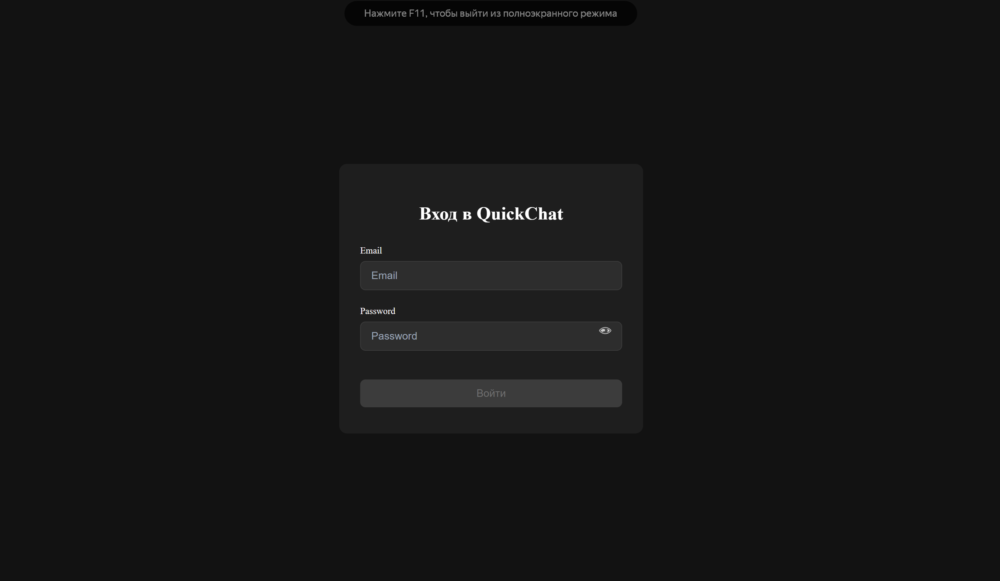

# QuickChat 💬

Современное веб-приложение для обмена мгновенными сообщениями в реальном времени, построенное на React и Firebase.



## 📋 Описание

QuickChat — это полнофункциональное приложение для чата с поддержкой регистрации пользователей, создания личных бесед и обмена сообщениями в реальном времени. Приложение использует Firebase для аутентификации и хранения данных, обеспечивая мгновенную синхронизацию сообщений между всеми участниками.

## ✨ Основные возможности

- 🔐 **Аутентификация пользователей** — регистрация и вход через Firebase Authentication
- 💬 **Обмен сообщениями в реальном времени** — мгновенная доставка сообщений с использованием Firestore
- 👥 **Личные чаты** — создание приватных бесед между пользователями
- 🔔 **Push-уведомления** — оповещения о новых сообщениях
- 📱 **Адаптивный дизайн** — оптимизирован для десктопа и мобильных устройств
- ✅ **Статусы сообщений** — отслеживание прочтения сообщений
- 🔢 **Счетчики непрочитанных** — персональные счетчики для каждого пользователя
- 📍 **Индикатор онлайн-статуса** — отображение активности пользователей

## 🛠️ Технологический стек

### Frontend

- **React 19** — современная библиотека для создания пользовательских интерфейсов
- **TypeScript** — типизированный JavaScript для надежного кода
- **Vite** — быстрый сборщик и сервер разработки
- **Zustand** — легковесное управление состоянием
- **CSS Modules** — модульные стили для изоляции компонентов

### Backend & Сервисы

- **Firebase Authentication** — аутентификация пользователей
- **Cloud Firestore** — NoSQL база данных в реальном времени
- **Firebase Hosting** — хостинг веб-приложения

### Инструменты разработки

- **ESLint** — линтер для проверки качества кода
- **React Compiler** — оптимизация производительности React
- **Vite PWA Plugin** — поддержка Progressive Web App

## 🚀 Быстрый старт

### Предварительные требования

- Node.js (версия 18 или выше)
- npm или yarn
- Аккаунт Firebase

### Установка

1. **Клонируйте репозиторий:**

```bash
git clone https://github.com/Yogurt7v/QuickChat.git
cd QuickChat
```

2. **Установите зависимости:**

```bash
npm install
```

3. **Настройте Firebase:**

Создайте файл `.env` в корневой директории проекта и добавьте свои Firebase учетные данные:

```env
VITE_FIREBASE_API_KEY=your_api_key
VITE_FIREBASE_AUTH_DOMAIN=your_auth_domain
VITE_FIREBASE_PROJECT_ID=your_project_id
VITE_FIREBASE_STORAGE_BUCKET=your_storage_bucket
VITE_FIREBASE_MESSAGING_SENDER_ID=your_sender_id
VITE_FIREBASE_APP_ID=your_app_id
```

4. **Запустите приложение в режиме разработки:**

```bash
npm run dev
```

Приложение будет доступно по адресу `http://localhost:5173`

## 📦 Скрипты

- `npm run dev` — запуск сервера разработки
- `npm run build` — сборка для продакшена
- `npm run preview` — предпросмотр production сборки
- `npm run lint` — проверка кода с ESLint
- `npm run deploy` — сборка и деплой на Firebase Hosting

## 📁 Структура проекта

```
QuickChat/
├── public/                    # Статические файлы
│   ├── screenshots/          # Скриншоты приложения
│   └── appicon-*.png        # Иконки приложения
├── src/
│   ├── assets/              # SVG иконки и изображения
│   ├── components/          # React компоненты
│   │   ├── ChatArea.tsx    # Область отображения сообщений
│   │   ├── ChatItem.tsx    # Элемент списка чатов
│   │   ├── Layout.tsx      # Главный layout приложения
│   │   ├── LoginForm.tsx   # Форма входа/регистрации
│   │   ├── MessageBubble.tsx # Пузырь сообщения
│   │   ├── MessageInput.tsx  # Поле ввода сообщения
│   │   ├── NewChatModal.tsx  # Модальное окно создания чата
│   │   └── Sidebar.tsx     # Боковая панель со списком чатов
│   ├── firebase/
│   │   └── config.ts       # Конфигурация Firebase
│   ├── hooks/              # Пользовательские хуки
│   │   ├── useAuth.ts      # Хук аутентификации
│   │   └── useIsMobile.ts  # Хук определения мобильного устройства
│   ├── services/           # Сервисы
│   │   ├── firestoreService.ts      # Работа с Firestore
│   │   └── notificationService.ts   # Push-уведомления
│   ├── store/              # Zustand хранилища
│   │   ├── authStore.ts    # Состояние аутентификации
│   │   └── chatStore.ts    # Состояние чатов
│   ├── styles/             # CSS модули
│   ├── types/              # TypeScript типы
│   │   └── index.ts        # Общие типы данных
│   ├── App.tsx             # Главный компонент приложения
│   └── main.tsx            # Точка входа
├── .env                    # Переменные окружения (не в git)
├── firebase.json           # Конфигурация Firebase
├── package.json            # Зависимости проекта
└── vite.config.ts          # Конфигурация Vite
```

## 🎨 Основные компоненты

### ChatArea

Компонент отображения активного чата с историей сообщений и полем ввода.

### Sidebar

Боковая панель со списком всех чатов пользователя, счетчиками непрочитанных и возможностью создания новых бесед.

### MessageBubble

Визуальное представление одного сообщения с поддержкой различных стилей для своих и чужих сообщений.

### LoginForm

Форма входа и регистрации с валидацией и обработкой ошибок.

## 🔧 Firebase настройка

### Firestore структура данных

**Коллекция `chats`:**

```typescript
{
  id: string,
  name: string,
  participants: string[],
  participantNames: { [userId: string]: string },
  lastMessage: string,
  timestamp: string,
  unreadCounts: { [userId: string]: number },
  isOnline: boolean
}
```

**Подколлекция `chats/{chatId}/messages`:**

```typescript
{
  id: string,
  text: string,
  senderId: string,
  senderName: string,
  timestamp: Timestamp,
  status: 'sent' | 'delivered' | 'read',
  readBy: string[]
}
```

**Коллекция `users`:**

```typescript
{
  uid: string,
  email: string,
  displayName: string,
  photoURL: string,
  createdAt: Timestamp
}
```

## 🌐 Деплой

Приложение настроено для деплоя на Firebase Hosting:

```bash
npm run deploy
```

Эта команда выполнит сборку проекта и автоматически загрузит его на Firebase Hosting.

## 🤝 Участие в разработке

Приветствуются любые предложения и улучшения! Для участия в разработке:

1. Форкните репозиторий
2. Создайте ветку для новой функции (`git checkout -b feature/AmazingFeature`)
3. Зафиксируйте изменения (`git commit -m 'Add some AmazingFeature'`)
4. Отправьте изменения в ветку (`git push origin feature/AmazingFeature`)
5. Откройте Pull Request

## 📄 Лицензия

Этот проект распространяется под MIT лицензией.

## 👤 Автор

**Yogurt7v**

- GitHub: [@Yogurt7v](https://github.com/Yogurt7v)
- Проект: [QuickChat](https://github.com/Yogurt7v/QuickChat)

## 📞 Поддержка

Если у вас возникли вопросы или проблемы, пожалуйста, создайте [Issue](https://github.com/Yogurt7v/QuickChat/issues) в репозитории.

---

⭐ Если вам понравился проект, поставьте звезду на GitHub!
