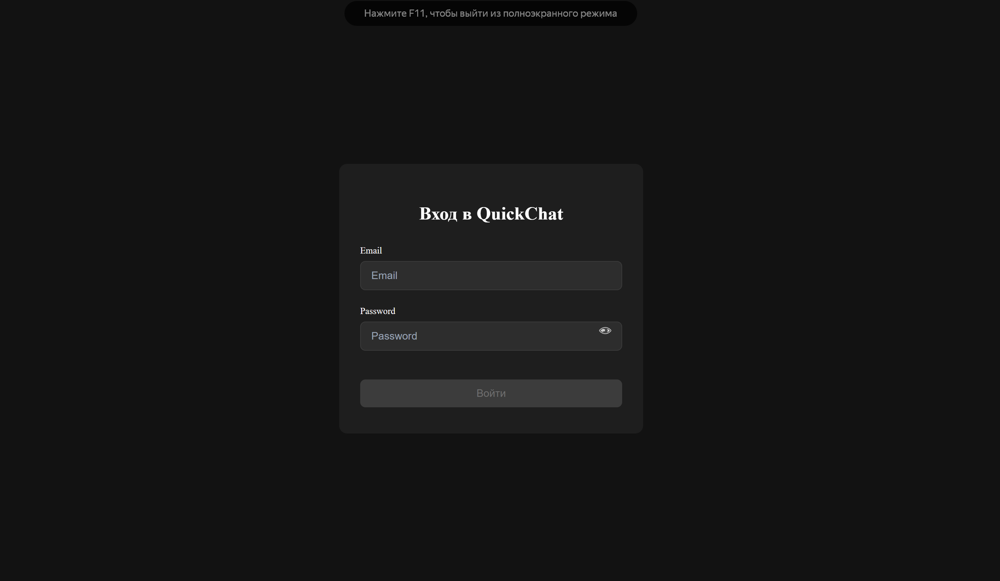

# QuickChat 💬

Современное веб-приложение для обмена мгновенными сообщениями в реальном времени, построенное на React и Firebase.



## 📋 Описание

QuickChat — это полнофункциональное приложение для чата с поддержкой регистрации пользователей, создания личных бесед и обмена сообщениями в реальном времени. Приложение использует Firebase для аутентификации и хранения данных, обеспечивая мгновенную синхронизацию сообщений между всеми участниками.

## ✨ Основные возможности

- 🔐 **Аутентификация пользователей** — регистрация и вход через Firebase Authentication
- 💬 **Обмен сообщениями в реальном времени** — мгновенная доставка сообщений с использованием Firestore
- 👥 **Личные чаты** — создание приватных бесед между пользователями
- 🔔 **Push-уведомления** — оповещения о новых сообщениях через Supabase
- 📱 **Адаптивный дизайн** — оптимизирован для десктопа и мобильных устройств с PWA поддержкой
- ✅ **Статусы сообщений** — отслеживание прочтения сообщений
- 🔢 **Счетчики непрочитанных** — персональные счетчики для каждого пользователя
- 📍 **Индикатор онлайн-статуса** — отображение активности пользователей
- 📎 **Отправка файлов** — загрузка изображений и файлов с автоматическим сжатием
- 🔄 **Пересылка сообщений** — возможность пересылать сообщения в другие чаты
- ✏️ **Редактирование профиля** — изменение имени, аватара и других данных
- 🎨 **Темная тема** — переключение между светлой и темной темами
- 🔍 **Поиск** — поиск по чатам и сообщениям
- 💭 **Индикатор печати** — показ, когда пользователь печатает
- 🖱️ **Drag and Drop** — перетаскивание для изменения порядка чатов в боковой панели
- 🚀 **PWA** — установка как нативное приложение на устройство

## 🛠️ Технологический стек

### Frontend

- **React 19** — современная библиотека для создания пользовательских интерфейсов
- **TypeScript** — типизированный JavaScript для надежного кода
- **Vite** — быстрый сборщик и сервер разработки
- **Zustand** — легковесное управление состоянием
- **CSS Modules** — модульные стили для изоляции компонентов
- **Sass** — препроцессор CSS для расширенного стилизирования
- **Markdown-it** — рендеринг Markdown в сообщениях
- **@dnd-kit** — библиотека для drag and drop функциональности

### Backend & Сервисы

- **Firebase Authentication** — аутентификация пользователей
- **Cloud Firestore** — NoSQL база данных в реальном времени
- **Firebase Hosting** — хостинг веб-приложения
- **Supabase** — дополнительная интеграция для push-уведомлений и файлового хранения
- **Firebase Functions** — серверные функции для обработки данных

### Инструменты разработки

- **ESLint** — линтер для проверки качества кода
- **React Compiler** — оптимизация производительности React
- **Vite PWA Plugin** — поддержка Progressive Web App
- **Firebase Tools** — инструменты для развертывания и эмуляторов

## 🚀 Быстрый старт

### Предварительные требования

- Node.js (версия 18 или выше)
- npm или yarn
- Аккаунт Firebase

### Установка

1. **Клонируйте репозиторий:**

```bash
git clone https://github.com/Yogurt7v/QuickChat.git
cd QuickChat
```

2. **Установите зависимости:**

```bash
npm install
```

3. **Настройте Firebase:**

Создайте файл `.env` в корневой директории проекта и добавьте свои Firebase учетные данные:

```env
VITE_FIREBASE_API_KEY=your_api_key
VITE_FIREBASE_AUTH_DOMAIN=your_auth_domain
VITE_FIREBASE_PROJECT_ID=your_project_id
VITE_FIREBASE_STORAGE_BUCKET=your_storage_bucket
VITE_FIREBASE_MESSAGING_SENDER_ID=your_sender_id
VITE_FIREBASE_APP_ID=your_app_id
```

4. **Запустите приложение в режиме разработки:**

```bash
npm run dev
```

Приложение будет доступно по адресу `http://localhost:5173`

## 📦 Скрипты

- `npm run dev` — запуск сервера разработки
- `npm run build` — сборка для продакшена
- `npm run preview` — предпросмотр production сборки
- `npm run lint` — проверка кода с ESLint
- `npm run deploy` — сборка и деплой на Firebase Hosting
- `npm run deploy:functions` — деплой Firebase Functions
- `npm run emulators` — запуск Firebase эмуляторов для локальной разработки

## 📁 Структура проекта

```
QuickChat/
├── public/                          # Статические файлы
│   ├── screenshots/                # Скриншоты приложения
│   ├── appicon-*.png              # Иконки приложения
│   ├── manifest.json              # Манифест PWA
│   └── service-worker.js          # Service Worker для PWA
├── src/
│   ├── assets/                    # SVG иконки и изображения
│   ├── components/                # React компоненты
│   │   ├── chat/                  # Компоненты чата
│   │   │   ├── ChatArea.tsx      # Область отображения сообщений
│   │   │   ├── ChatHeader.tsx    # Заголовок чата
│   │   │   ├── ChatPlaceholder.tsx # Заглушка при отсутствии чата
│   │   │   ├── FileUploadProgress.tsx # Прогресс загрузки файлов
│   │   │   ├── Loader.tsx        # Индикатор загрузки
│   │   │   ├── MessageBubble.tsx # Пузырь сообщения
│   │   │   ├── MessageInput.tsx  # Поле ввода сообщения
│   │   │   └── MessagesList.tsx  # Список сообщений
│   │   ├── layout/               # Компоненты layout
│   │   │   └── Layout.tsx        # Главный layout приложения
│   │   ├── login/                # Компоненты авторизации
│   │   │   └── LoginForm.tsx     # Форма входа/регистрации
│   │   ├── modals/               # Модальные окна
│   │   │   ├── ChatActionModal.tsx # Действия с чатом
│   │   │   ├── EditProfileModal.tsx # Редактирование профиля
│   │   │   ├── ForwardModal.tsx   # Пересылка сообщений
│   │   │   ├── NewChatModal.tsx  # Создание нового чата
│   │   │   └── common/           # Общие компоненты модалов
│   │   │       ├── ModalButtons.tsx
│   │   │       ├── ModalHeader.tsx
│   │   │       └── ModalOverlay.tsx
│   │   ├── profile/              # Компоненты профиля
│   │   │   ├── AvatarUploader.tsx # Загрузчик аватара
│   │   │   └── ProfileForm.tsx   # Форма профиля
│   │   ├── sidebar/              # Компоненты боковой панели
│   │   │   ├── Avatar.tsx        # Аватар пользователя
│   │   │   ├── ChatContent.tsx   # Содержимое чата в sidebar
│   │   │   ├── ChatItem.tsx      # Элемент списка чатов
│   │   │   ├── DragHandle.tsx    # Ручка для перетаскивания
│   │   │   ├── Sidebar.tsx       # Боковая панель
│   │   │   └── SidebarSkeleton.tsx # Скелетон загрузки sidebar
│   │   └── ui/                   # UI компоненты
│   │       ├── NotificationPermissionBanner.tsx # Баннер разрешений уведомлений
│   │       ├── NotificationToggle.tsx # Переключатель уведомлений
│   │       └── ThemeToggle.tsx   # Переключатель темы
│   ├── firebase/                 # Конфигурация Firebase
│   │   └── config.ts
│   ├── hooks/                    # Пользовательские хуки
│   │   ├── useAuth.ts            # Аутентификация
│   │   ├── useChatItemData.ts    # Данные элемента чата
│   │   ├── useChatItemHandlers.ts # Обработчики элемента чата
│   │   ├── useChatPartner.ts     # Партнер по чату
│   │   ├── useCurrentUser.ts     # Текущий пользователь
│   │   ├── useFileHandling.ts    # Обработка файлов
│   │   ├── useIsMobile.ts        # Определение мобильного устройства
│   │   ├── useKeyboardShortcuts.ts # Клавиатурные сокращения
│   │   ├── useMessageActions.ts  # Действия с сообщениями
│   │   ├── useMessagesSubscription.ts # Подписка на сообщения
│   │   ├── useOnlineStatus.ts    # Онлайн статус
│   │   ├── useProfileSave.ts     # Сохранение профиля
│   │   ├── useProfileState.ts    # Состояние профиля
│   │   ├── usePushNotifications.ts # Push-уведомления
│   │   ├── usePushSubscription.ts # Подписка на push
│   │   ├── useScrollToBottom.ts  # Прокрутка вниз
│   │   ├── useSendFileMessage.ts # Отправка файловых сообщений
│   │   ├── useSidebarSkeleton.ts # Скелетон sidebar
│   │   ├── useTheme.ts           # Тема приложения
│   │   ├── useTypingUsers.ts     # Пользователи, печатающие
│   │   └── useUserStatus.ts      # Статус пользователя
│   ├── services/                 # Сервисы
│   │   ├── compressingImage.ts   # Сжатие изображений
│   │   ├── convertFileUrlToEdgeFunction.ts # Конвертация URL файлов
│   │   ├── firestoreService.ts   # Работа с Firestore
│   │   ├── formatChatTime.ts     # Форматирование времени чата
│   │   ├── formatLastSeen.ts     # Форматирование последнего посещения
│   │   ├── pushService.ts        # Push-уведомления
│   │   └── firestore/            # Сервисы Firestore
│   │       ├── chatOrderService.ts # Порядок чатов
│   │       ├── chatService.ts    # Сервис чатов
│   │       ├── messageService.ts # Сервис сообщений
│   │       ├── searchService.ts  # Поиск
│   │       ├── typingService.ts  # Сервис печати
│   │       └── userService.ts    # Сервис пользователей
│   ├── store/                    # Zustand хранилища
│   │   ├── authStore.ts          # Состояние аутентификации
│   │   └── chatStore.ts          # Состояние чатов
│   ├── styles/                   # CSS модули
│   ├── supabase/                 # Интеграция Supabase
│   │   ├── pushService.ts        # Push через Supabase
│   │   ├── supabaseClient.ts     # Клиент Supabase
│   │   └── uploadFileToSupabase.ts # Загрузка файлов в Supabase
│   ├── types/                    # TypeScript типы
│   │   └── index.ts              # Общие типы данных
│   ├── App.tsx                   # Главный компонент приложения
│   ├── constants.ts              # Константы
│   └── main.tsx                  # Точка входа
├── .env.local                    # Локальные переменные окружения
├── firebase.json                 # Конфигурация Firebase
├── package.json                  # Зависимости проекта
├── vite.config.ts                # Конфигурация Vite
└── scripts/                      # Скрипты
```

## 🎨 Основные компоненты

### ChatArea

Компонент отображения активного чата с историей сообщений и полем ввода.

### Sidebar

Боковая панель со списком всех чатов пользователя, счетчиками непрочитанных и возможностью создания новых бесед.

### MessageBubble

Визуальное представление одного сообщения с поддержкой различных стилей для своих и чужих сообщений.

### LoginForm

Форма входа и регистрации с валидацией и обработкой ошибок.

## 🤝 Участие в разработке

Приветствуются любые предложения и улучшения! Для участия в разработке:

1. Форкните репозиторий
2. Создайте ветку для новой функции (`git checkout -b feature/AmazingFeature`)
3. Зафиксируйте изменения (`git commit -m 'Add some AmazingFeature'`)
4. Отправьте изменения в ветку (`git push origin feature/AmazingFeature`)
5. Откройте Pull Request

## 📄 Лицензия

Этот проект распространяется под MIT лицензией.

## 👤 Автор

**Yogurt7v**

- GitHub: [@Yogurt7v](https://github.com/Yogurt7v)
- Проект: [QuickChat](https://github.com/Yogurt7v/QuickChat)

## 📞 Поддержка

Если у вас возникли вопросы или проблемы, пожалуйста, создайте [Issue](https://github.com/Yogurt7v/QuickChat/issues) в репозитории.

---

⭐ Если вам понравился проект, поставьте звезду на GitHub!
